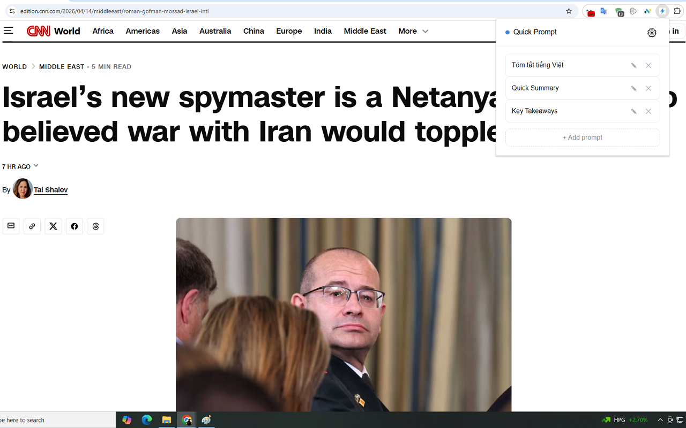
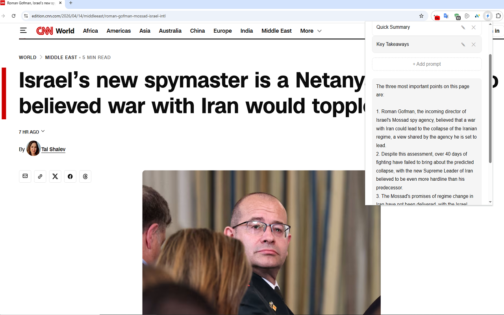

# ⚡ Quick Prompt

A Chrome Extension that lets you save your favorite AI prompts and run them on any webpage with one click.

## Features

- 💾 Save unlimited prompts with custom titles
- ⚡ Run any prompt on the current webpage instantly
- ✏️ Edit or delete prompts anytime
- 🌍 Works in any language
- 🔑 Use your own free Groq API key

## Demo




## Installation

### From Chrome Web Store
https://chromewebstore.google.com/detail/quick-prompt/cfamenpeoefdmgjhjnigmakgbdnedoen

### Manual Installation (Developer Mode)
1. Clone this repository
```bash
git clone https://github.com/docuong1666-creator/Quick-Prompt.git
```
2. Open Chrome → go to `chrome://extensions`
3. Enable **Developer mode** (top right)
4. Click **Load unpacked** → select the project folder

## Setup

1. Get a free API key at [console.groq.com](https://console.groq.com)
2. Click the Quick Prompt icon in your toolbar
3. Click ⚙️ Settings → enter your Groq API key → Save
4. Add your prompts and start using!

## How to Use

1. Open any webpage
2. Click the Quick Prompt icon
3. Click any saved prompt → AI will analyze the page and respond instantly

## Example Prompts

| Title | Prompt |
|-------|--------|
| Summarize | Summarize this page in 5 bullet points |
| Pros & Cons | List the pros and cons mentioned on this page |
| Explain Simply | Explain the main topic as if I'm a beginner |
| Key Takeaways | What are the 3 most important points on this page? |
| Quiz Me | Create 3 quiz questions based on this page |

## Tech Stack

- **Frontend:** HTML, CSS, JavaScript
- **API:** [Groq API](https://groq.com) (llama-3.3-70b-versatile)
- **Storage:** chrome.storage.local

## Privacy

Quick Prompt does not collect any personal data. All prompts and API keys are stored locally on your device.

[Privacy Policy](https://docuong1666-creator.github.io/Quick-Prompt/privacy-policy)

## License

MIT License — feel free to use and modify!
